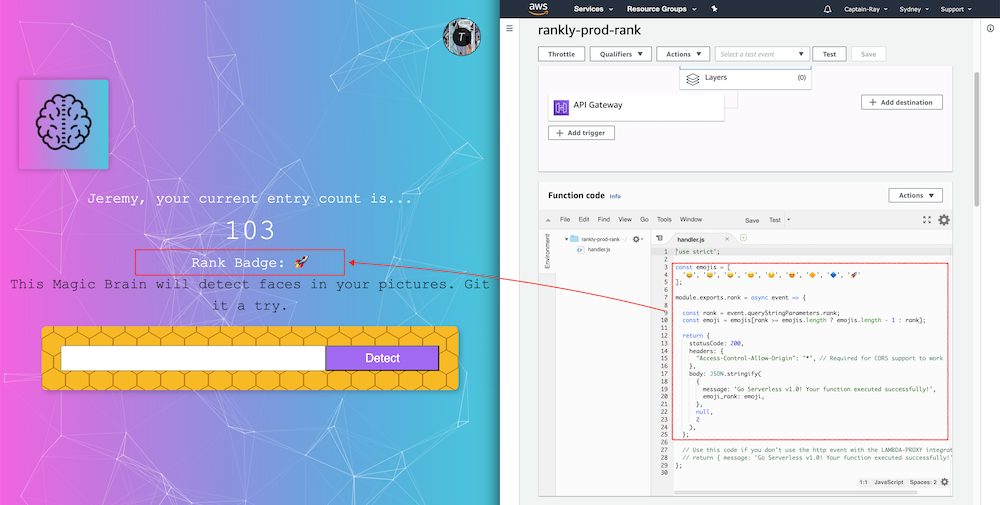
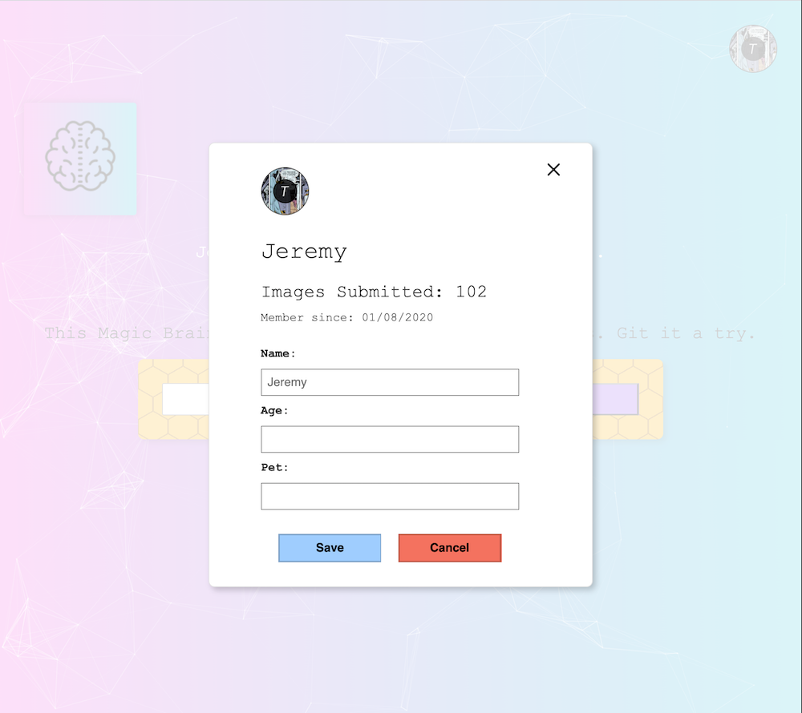
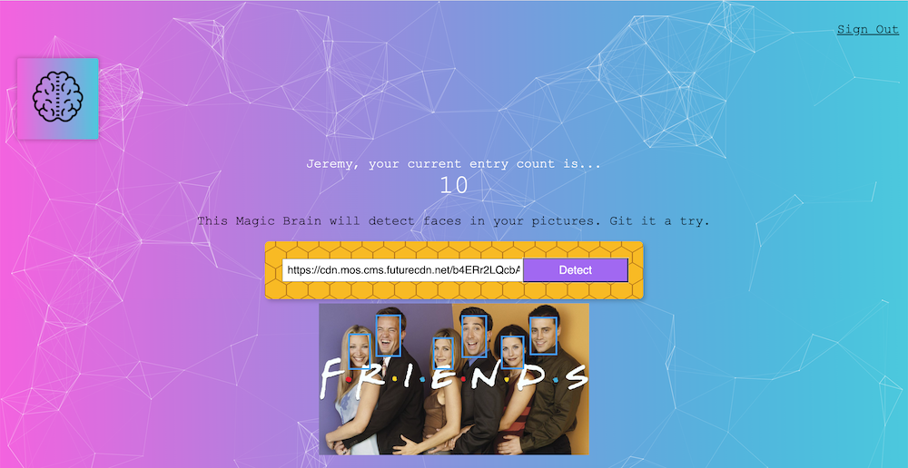
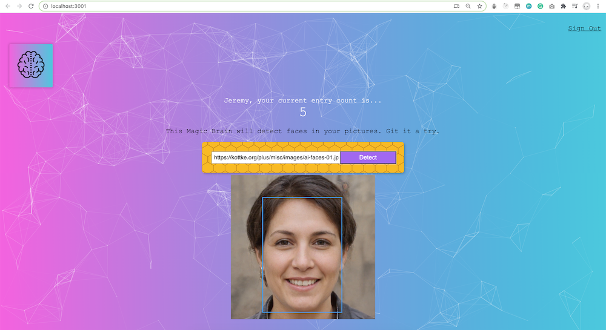

# SmartBrain - Client
Detect human faces in a picture.

Tech Stack:

1. React.js
2. tachyons
3. Clarifai API - for AI face recognition

##### vesion4:

- Get rank emoji from AWS lambda and render on the page
  - create AWS lambda using serverless
  - create a function that respond with emoji based on the entries of uploading images from users

##### version3:

- add a Profile modal
  - used Portals in React, to create a DOM node that exists outside the DOM hierarchy

##### version2:

- recognize multiple faces

##### version1: 

- initial project
- only recognize one face

